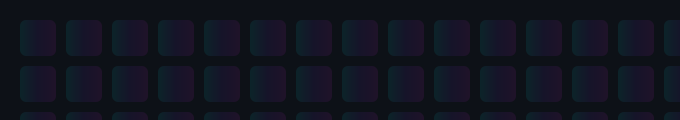

<!-- ====================================================== -->
<!--        FAHID HASAN FUAD · FUTURISTIC GITHUB README       -->
<!-- ====================================================== -->

<div align="center">

<!-- 🖥️ TERMINAL BOOT SEQUENCE (typed as command-line output) -->
<a href="https://github.com/Fahid24">
  
</a>

</div>

<!-- 🪟 FAKE TERMINAL WINDOW -->
<div align="center">

```bash
┌─[ fahid@dev ]─[ ~/portfolio ]
└──╼ $ cat profile.json
{
  "name"      : "Fahid Hasan Fuad",
  "role"      : "Software Engineer",
  "status"    : "🟢 Online — Open to Work",
  "stack"     : ["React", "Next.js", "Node.js", "FastAPI"],
  "focus"     : "Frontend · Backend · AI Integration",
  "uptime"    : "Building scalable experiences ⚡"
}
┌─[ fahid@dev ]─[ ~/portfolio ]
└──╼ $ ▮
```

</div>

<!-- 🎛️ STATUS CHIPS -->
<div align="center">

[](https://github.com/Fahid24)


</div>

<!-- ⚡ NEON DIVIDER -->
<div align="center">

</div>

<!-- ====================================================== -->

<h2 align="center">🧠 &nbsp; About Me &nbsp; 🧠</h2>

<div align="center">

```ts
const fahid = {
    name:        "Fahid Hasan Fuad",
    role:        "Software Engineer",
    focus:       ["Frontend Development", "Backend Development"],
    code:        ["TypeScript", "JavaScript", "Python"],
    stack:       ["React", "Next.js", "Node.js", "FastAPI", "MySQL", "MongoDB"],
    learning:    "📱 Mobile App Development (iOS & Android)",
    interests:   ["AI Integration", "API Systems", "Performance-Driven Design"],
    mindset:     "Write clean, efficient & maintainable code. ⚡",
};
```

</div>

- 💼 **Software Engineer** with a strong focus on **frontend and backend** development
- ⚙️ Experienced in **React.js, Next.js, Node.js, FastAPI, MySQL, and MongoDB**
- 🧩 Passionate about building **scalable and user-friendly** web solutions
- 💡 Currently learning **mobile app development** for iOS & Android
- 🧠 Interested in **AI integration, API systems, and performance-driven design**
- 🎯 Always striving to write **clean, efficient, and maintainable** code

<!-- ====================================================== -->

<h2 align="center">🏅 &nbsp; Achievements &nbsp; 🏅</h2>

<div align="center">


</div>

<!-- ====================================================== -->

<h2 align="center">🛸 &nbsp; Tech Arsenal &nbsp; 🛸</h2>

<div align="center">

<table>
  <tr>
    <td align="center" valign="top" width="33%">
      <b>🎨 Frontend</b><br/><br/>
      <br/>
      <br/>
      <br/>
      <br/>
      
    </td>
    <td align="center" valign="top" width="33%">
      <b>⚙️ Backend</b><br/><br/>
      <br/>
      <br/>
      <br/>
      <br/>
      
    </td>
    <td align="center" valign="top" width="33%">
      <b>☁️ Cloud &amp; Tools</b><br/><br/>
      <br/>
      <br/>
      <br/>
      <br/>
      
    </td>
  </tr>
</table>

<br/>

<!-- 📊 LANGUAGE & TOOL ICONS (clean visual row) -->


</div>

<!-- ====================================================== -->

<h2 align="center">📡 &nbsp; GitHub Command Center &nbsp; 📡</h2>

<div align="center">

<!-- ⚡ MAIN STATS CARD -->


<!-- 🔥 TOP LANGUAGES -->


</div>

<div align="center">

<!-- 🌟 STREAK STATS -->


</div>

<!-- ====================================================== -->

<h2 align="center">🪐 &nbsp; Contribution Universe &nbsp; 🪐</h2>

<div align="center">

<!-- 🐍 SNAKE EATING CONTRIBUTIONS (needs the snake workflow — see SETUP.md) -->
<!-- 🐍 SNAKE: This animated "snake" requires the GitHub Action from SETUP.md to generate the SVG.
  If you don't run the workflow the image will 404. Using a reliable fallback below. -->
<!-- Primary: workflow-generated contribution snake (live). The workflow writes to `output/github-contribution-grid-snake-dark.svg`.
  Fallback: local animated SVG in `assets/` for viewers before the workflow has run. -->

<br/>
<!-- Fallback shown below when the generated file is not present yet -->


<!-- 📈 ACTIVITY GRAPH -->


</div>

<!-- ====================================================== -->

<h2 align="center">🏆 &nbsp; Trophy Showcase &nbsp; 🏆</h2>

<div align="center">


</div>

<!-- ====================================================== -->

<h2 align="center">🌐 &nbsp; Connect With Me &nbsp; 🌐</h2>

<div align="center">

<a href="https://github.com/Fahid24">
  
</a>
<a href="#">
  
</a>
<a href="#">
  
</a>
<a href="#">
  
</a>

</div>

<!-- ====================================================== -->

<div align="center">

<!-- 👁️ PROFILE VIEWS -->


<br/><br/>

<!-- ✨ QUOTE -->


<br/>

<!-- 🌊 NEON FOOTER WAVE -->


<sub>⭐ From <a href="https://github.com/Fahid24">Fahid Hasan Fuad</a> — Crafted with futuristic energy.</sub>

</div>
